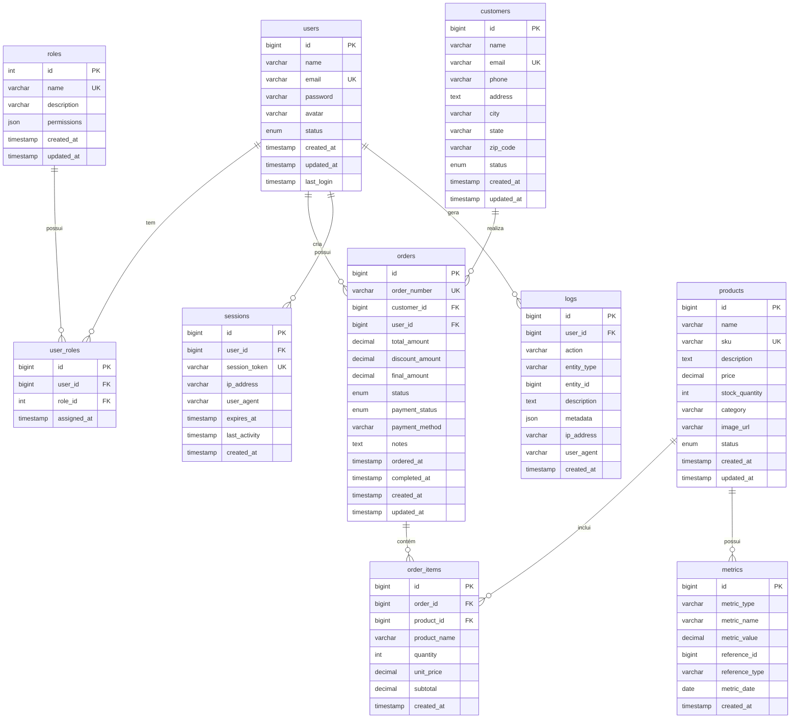

# 📊 Diagrama Entidade-Relacionamento (ER)
## Dashboard Administrativo - MySQL Database

---

## 🎯 Modelo Conceitual

Este banco de dados foi projetado para suportar um **Dashboard Administrativo** completo com:
- Gestão de usuários e permissões
- Controle de produtos e estoque
- Processamento de pedidos
- Gestão de clientes
- Métricas e KPIs em tempo real
- Sistema de logs e auditoria
- Gerenciamento de sessões

---

## 📐 Diagrama ER (Mermaid)

---

## 🔗 Relacionamentos

### 1. **Users ↔ Roles** (N:N)
- Um usuário pode ter múltiplos papéis (Admin, Editor, Viewer)
- Um papel pode ser atribuído a múltiplos usuários
- Tabela intermediária: `user_roles`

### 2. **Customers ↔ Orders** (1:N)
- Um cliente pode ter múltiplos pedidos
- Um pedido pertence a um único cliente

### 3. **Users ↔ Orders** (1:N)
- Um usuário (vendedor/admin) pode processar múltiplos pedidos
- Um pedido é processado por um único usuário

### 4. **Orders ↔ Order Items** (1:N)
- Um pedido pode ter múltiplos itens
- Um item pertence a um único pedido

### 5. **Products ↔ Order Items** (1:N)
- Um produto pode estar em múltiplos itens de pedido
- Um item de pedido referencia um único produto

### 6. **Users ↔ Sessions** (1:N)
- Um usuário pode ter múltiplas sessões ativas
- Uma sessão pertence a um único usuário

### 7. **Users ↔ Logs** (1:N)
- Um usuário pode gerar múltiplos logs
- Um log é gerado por um único usuário

---

## 📊 Modelo Lógico

### **Normalização: 3FN (Terceira Forma Normal)**

#### ✅ 1FN (Primeira Forma Normal)
- Todos os atributos são atômicos
- Não há grupos repetidos
- Cada célula contém um único valor

#### ✅ 2FN (Segunda Forma Normal)
- Cumpre 1FN
- Todos os atributos não-chave dependem completamente da chave primária
- Não há dependências parciais

#### ✅ 3FN (Terceira Forma Normal)
- Cumpre 2FN
- Não há dependências transitivas
- Atributos não-chave dependem apenas da chave primária

---

## 🎯 Principais Tabelas

### 1️⃣ **users** - Usuários do Sistema
Armazena todos os usuários que podem acessar o dashboard.

**Campos principais:**
- `id`: Identificador único
- `email`: Email único para login
- `password`: Hash da senha (bcrypt recomendado)
- `status`: active, inactive, suspended
- `last_login`: Último acesso do usuário

**Índices:**
- PRIMARY KEY (`id`)
- UNIQUE KEY (`email`)
- INDEX (`status`)

---

### 2️⃣ **roles** - Papéis/Permissões
Define os diferentes níveis de acesso no sistema.

**Campos principais:**
- `name`: Nome único do papel (Admin, Editor, Viewer)
- `permissions`: JSON com permissões detalhadas

**Papéis padrão:**
- **Admin**: Acesso total
- **Editor**: Pode criar e editar
- **Viewer**: Apenas visualização

---

### 3️⃣ **customers** - Clientes
Armazena informações dos clientes que realizam pedidos.

**Campos principais:**
- `name`: Nome completo
- `email`: Email único
- `phone`: Telefone de contato
- `address`: Endereço completo
- `status`: active, inactive

---

### 4️⃣ **products** - Produtos
Catálogo de produtos disponíveis.

**Campos principais:**
- `sku`: Código único do produto
- `price`: Preço unitário
- `stock_quantity`: Quantidade em estoque
- `category`: Categoria do produto
- `status`: active, inactive, out_of_stock

**Índices:**
- INDEX (`category`)
- INDEX (`status`)
- INDEX (`stock_quantity`)

---

### 5️⃣ **orders** - Pedidos
Registra todos os pedidos realizados.

**Campos principais:**
- `order_number`: Número único do pedido (ORD-XXXX)
- `customer_id`: Referência ao cliente
- `user_id`: Vendedor que processou
- `status`: pending, processing, completed, cancelled
- `payment_status`: pending, paid, failed, refunded
- `final_amount`: Valor final com descontos

**Índices:**
- INDEX (`customer_id`)
- INDEX (`user_id`)
- INDEX (`status`)
- INDEX (`payment_status`)
- INDEX (`ordered_at`)

---

### 6️⃣ **order_items** - Itens do Pedido
Detalhes de cada produto em um pedido.

**Campos principais:**
- `product_name`: Nome do produto (desnormalizado para histórico)
- `quantity`: Quantidade comprada
- `unit_price`: Preço unitário no momento da compra
- `subtotal`: Total do item (quantity × unit_price)

---

### 7️⃣ **metrics** - Métricas e KPIs
Armazena métricas para os gráficos do dashboard.

**Tipos de métricas:**
- `daily_revenue`: Receita diária
- `monthly_revenue`: Receita mensal
- `user_count`: Contagem de usuários
- `order_count`: Contagem de pedidos
- `product_views`: Visualizações de produtos
- `conversion_rate`: Taxa de conversão

**Campos principais:**
- `metric_type`: Tipo da métrica
- `metric_value`: Valor numérico
- `reference_id`: ID da entidade relacionada
- `metric_date`: Data da métrica

---

### 8️⃣ **logs** - Logs de Auditoria
Registra todas as ações importantes no sistema.

**Ações típicas:**
- `user.login` / `user.logout`
- `user.create` / `user.update` / `user.delete`
- `order.create` / `order.update` / `order.cancel`
- `product.create` / `product.update` / `product.delete`

**Campos principais:**
- `action`: Nome da ação
- `entity_type`: Tipo de entidade (user, order, product)
- `entity_id`: ID da entidade
- `metadata`: Dados adicionais em JSON
- `ip_address`: IP do usuário
- `user_agent`: Navegador/dispositivo

---

### 9️⃣ **sessions** - Sessões Ativas
Gerencia sessões de usuários logados.

**Campos principais:**
- `session_token`: Token único da sessão
- `expires_at`: Data de expiração
- `last_activity`: Última atividade
- `ip_address`: IP da sessão
- `user_agent`: Dispositivo/navegador

---

## 🎨 Campos Padronizados

### ⏰ Timestamps Automáticos
Todas as tabelas principais possuem:
- `created_at`: Data de criação (CURRENT_TIMESTAMP)
- `updated_at`: Data de atualização (ON UPDATE CURRENT_TIMESTAMP)

### 🔑 Chaves Primárias
- Todas usam `BIGINT AUTO_INCREMENT` para suportar grandes volumes
- Nomeadas como `id` para simplicidade

### 🌐 Charset e Collation
- `utf8mb4`: Suporte completo a caracteres Unicode
- `utf8mb4_unicode_ci`: Case-insensitive, suporta emojis

---

## 📈 Índices e Performance

### Índices Criados:
1. **PRIMARY KEY** em todas as tabelas
2. **UNIQUE KEY** em emails, SKUs, tokens
3. **FOREIGN KEY** com ON DELETE CASCADE
4. **INDEX** em campos frequentemente filtrados:
   - Status fields
   - Datas
   - Referências estrangeiras

### Otimizações:
- Índices compostos para queries complexas
- Desnormalização controlada (product_name em order_items)
- Uso de ENUM para campos com valores fixos
- JSON para dados flexíveis (permissions, metadata)

---

## 🚀 Próximos Passos

### Fase 2 - Melhorias Futuras:
1. **Tabela de Notificações**: Sistema de alertas
2. **Tabela de Configurações**: Configurações por usuário
3. **Tabela de Arquivos**: Upload de documentos/imagens
4. **Tabela de Comentários**: Comentários em pedidos
5. **Tabela de Cupons**: Sistema de descontos
6. **Tabela de Endereços**: Múltiplos endereços por cliente
7. **Tabela de Categorias**: Categorias hierárquicas
8. **Full-Text Search**: Busca avançada em produtos

### Fase 3 - Analytics Avançado:
1. **Data Warehouse**: Estrutura OLAP
2. **Tabelas de Agregação**: Pré-cálculo de métricas
3. **Particionamento**: Por data para logs e metrics
4. **Réplicas de Leitura**: Para relatórios pesados

---

## 📝 Convenções de Nomenclatura

- **Tabelas**: `snake_case`, plural (users, orders)
- **Colunas**: `snake_case` (created_at, order_number)
- **Foreign Keys**: `{tabela}_id` (user_id, customer_id)
- **Índices**: `idx_{tabela}_{coluna}` (idx_users_email)
- **Constraints**: `fk_{tabela}_{referencia}` (fk_orders_customers)

---

## ✅ Checklist de Implementação

- [x] Modelo conceitual definido
- [x] Diagrama ER em Mermaid
- [x] Normalização até 3FN
- [x] Índices planejados
- [x] Relacionamentos definidos
- [x] Tipos de dados otimizados
- [x] Constraints de integridade
- [x] Campos de auditoria (timestamps)
- [x] Documentação completa

---

## 📚 Referências

- **MySQL 8.0 Documentation**: https://dev.mysql.com/doc/
- **Database Normalization**: https://en.wikipedia.org/wiki/Database_normalization
- **ERD Best Practices**: https://www.lucidchart.com/pages/er-diagrams

---

**Criado por**: Desenvolvedor Sênior de Banco de Dados  
**Data**: Dezembro 2024  
**Versão**: 1.0.0  
**Compatibilidade**: MySQL 8.0+
